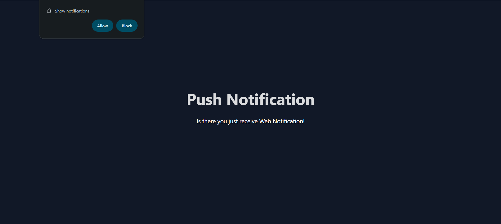
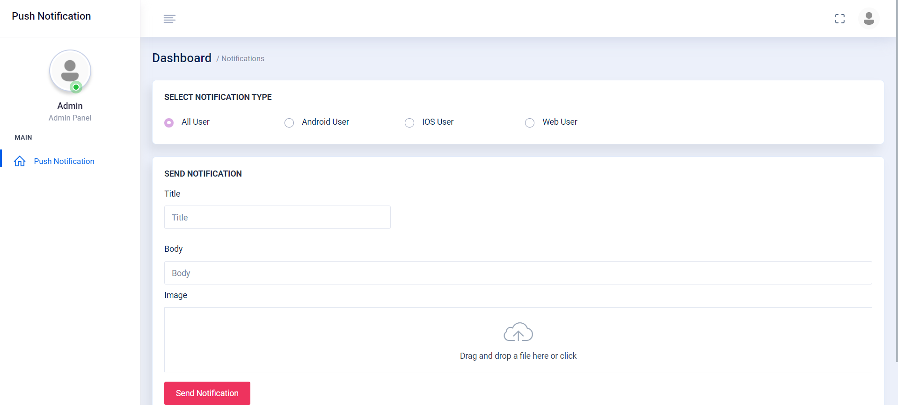
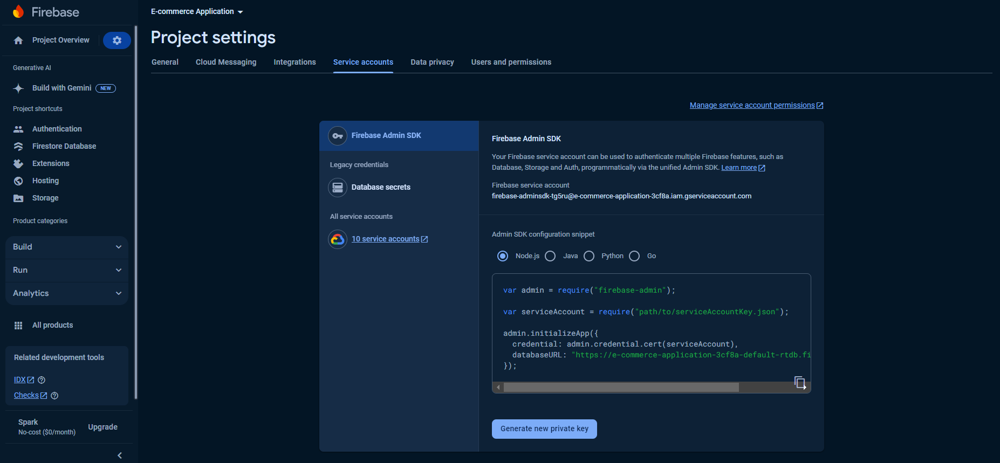

# Push Notification

 <!-- Replace with an actual path to an image in your project -->

This Laravel project implements a powerful push notification system designed to deliver notifications to Android and iOS mobile devices, as well as web applications. The system is built to ensure a seamless notification experience across different platforms, providing users with real-time updates regardless of the device they are using.

## Features

- **Mobile Notifications:** Send and receive push notifications on both Android and iOS devices using native notification frameworks.
- **Web Notifications:** Implement push notifications for web applications, ensuring users receive updates even in a browser environment.
- **Cross-Platform Support:** Unified approach to manage notifications across different platforms with consistent behavior.
- **Scalable Architecture:** Designed to handle large volumes of notifications efficiently.

## Screenshots

### Admin Panel Send notification 
 <!-- Replace with an actual path to an image in your project -->

## Getting Started

Follow these instructions to set up the project on your local machine.

### Prerequisites

- **PHP >= ^8.2**
- **Composer**
- **Laravel >= 11.9**

### Installation

1. **Clone the repository:**
   ```bash
   git clone https://github.com/FaaizanAli/push-notification.git


## After Clone Setup

Once you have cloned the repository, follow these steps to set up the project:

2. **Navigate to the project directory:**
   ```bash
   cd push-notification

3. **Navigate to the project directory and install composer:**
   ```bash
   composer install

4. **change file name .example.env to .env:**
   ```bash
   .env
5. **In .env file give your database credential:**
   ```bash
   DB_CONNECTION=mysql
    DB_HOST=127.0.0.1
    DB_PORT=3306
    DB_DATABASE=your_database_name
    DB_USERNAME=your_username
    DB_PASSWORD=your_password

6. **Run your migration command:**
   ```bash
   php artisan migration


## Setup Firebase

1. **Go to Firebase Console:**
   ```bash
   https://console.firebase.google.com

**Make a project and then generate new private key and put in your project directory with name firebase.json:**


